# Hello, I'm Daniel!

  

## About Me

I'm a computer science student at the University of Oslo, currently completing my bachelor's degree and planning to continue with a master's degree.

- Exploring both **frontend** and **backend** development
- Experience with **low-level C programming**, **functional programming**, and **system-level coding**
- Completed a fulfilling summer internship in 2025, enhancing my fullstack development skills

## Technologies & Tools

  

## GitHub Stats

  

 

  

